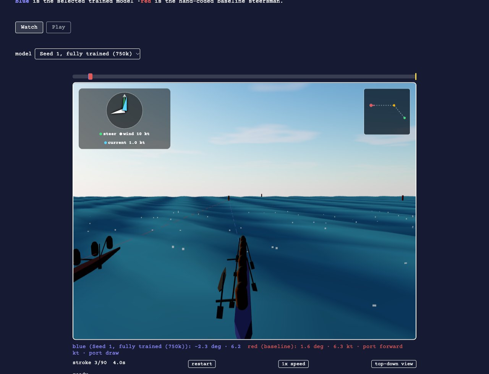
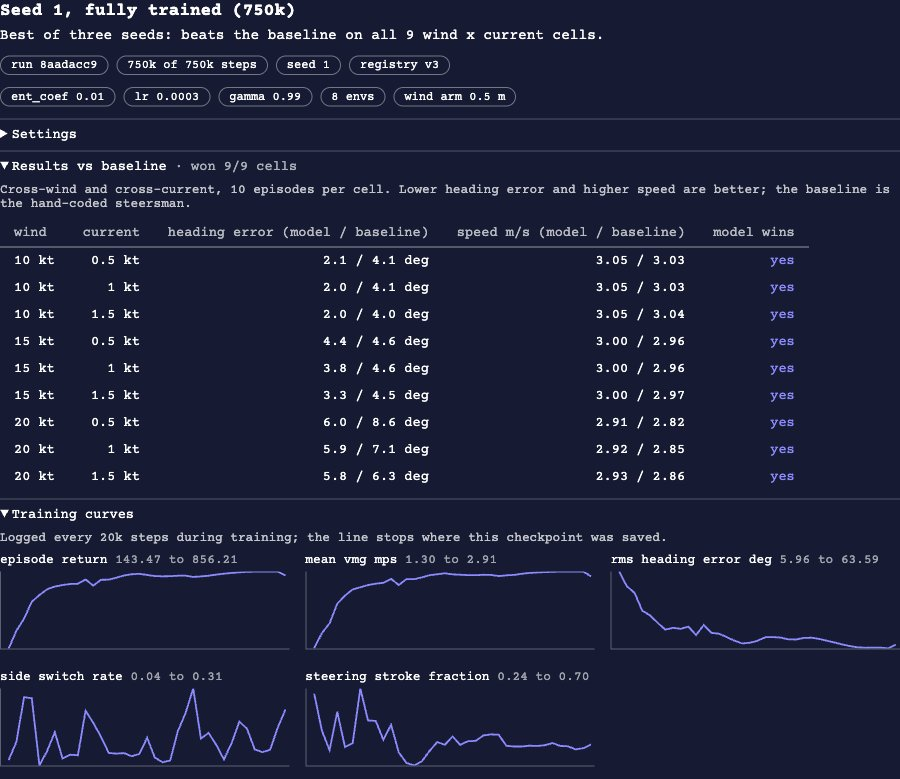

# mbatacan.github.io

Personal portfolio and blog, built with [Astro](https://astro.build) and deployed to GitHub Pages. It is a fully static site with no server and no client-side framework, and its `/lab` section runs two real machine-learning demos entirely in the visitor's browser.

**Live at:** https://mbatacan.github.io

## The lab

### Race an RL Paddler (`/lab/rl-paddler`)

Race a reinforcement-learning agent, or watch it duel a hand-coded baseline, steering an outrigger canoe (OC6) in 3D through cross-wind and cross-current.



- A dropdown switches between several trained PPO checkpoints. The panel under the game shows each one's training settings, its results against the baseline on a wind x current grid, and its training curves.
- The physics, training and evaluation live in a separate repo, [ama-flow](https://github.com/mbatacan/ama-flow). This site contains a from-scratch TypeScript port of ama-flow's physics core plus a tiny re-implementation of each policy's neural network (an 18 -> 64 -> 64 -> 8 MLP), so no ML runtime is needed.
- The port is checked against the Python original: `parity.json` holds golden trajectories and observation -> action pairs exported from ama-flow, and the test suite requires the TypeScript to reproduce them. Physics changes belong in ama-flow, never in the port.
- Models come from a Databricks model registry and are committed here as static JSON (`src/data/ama-flow/`, generated by ama-flow's exporter; don't edit by hand). The waves are cosmetic and never feed the physics.



### Fool the Classifier (`/lab/fool-the-classifier`)

Draw something and watch a pretrained sketch classifier guess it live; try to get it to recognize the word you're given.

## How it works

Everything is static: `npm run build` produces plain HTML, CSS and JavaScript, and inference runs in the browser. Nothing you draw or do on the site is sent to any server. Two third-party hosts are contacted by your browser on the classifier page only:

- [jsDelivr](https://www.jsdelivr.com/) serves `onnxruntime-web`, and
- [Hugging Face](https://huggingface.co/) serves the ONNX model file (cached in your browser after the first load).

The RL demo bundles its own weights and loads nothing from third parties.

## Development

```bash
npm install
npm run dev        # dev server at http://localhost:4321
npm run build      # static build -> dist/
npm run preview    # preview the built dist/ locally
npm test           # vitest: physics/policy parity, game logic, stroke geometry
npx astro check    # type check (also run in CI)
```

CI (`.github/workflows/ci.yml`) runs the tests, the type check and the build on every pull request. Project structure, conventions and the workflows below are described in more detail in [CLAUDE.md](CLAUDE.md).

### Adding a blog post

Create `src/content/blog/<slug>.md`:

```markdown
---
title: "Post Title"
date: 2024-01-15
description: "One-sentence description shown in meta tags and the blog listing."
---

Post content in Markdown...
```

The blog index picks it up automatically, sorted by date. The URL becomes `/blog/<slug>`.

### Adding or updating a lab project

Edit `src/data/lab-projects.ts`. Each entry has a `status` of `completed`, `in-progress`, or `idea`, and the `/lab` page groups by that automatically. A `completed` entry needs an `href`; the other two render as a non-clickable card.

### Updating the RL models

Edit the model manifest in the ama-flow repo and re-run its exporter into `src/data/ama-flow/`; see "Adding/updating a model on /lab/rl-paddler" in [CLAUDE.md](CLAUDE.md).

## Deployment

Pushing to `main` triggers `.github/workflows/deploy.yml`, which builds the site and pushes `dist/` to the `gh-pages` branch. GitHub Pages must be set to serve that branch (Settings -> Pages -> `gh-pages` / root).

## License and credits

The code is released under the [MIT License](LICENSE). Blog posts, photographs and other images are (c) Matthew Batacan, all rights reserved.

Built with the help of:

- the [Quick, Draw! dataset](https://quickdraw.withgoogle.com/data) (Google, CC BY 4.0) and [VinayHajare/quickdraw-mobilevit-small-onnx](https://huggingface.co/VinayHajare/quickdraw-mobilevit-small-onnx) (MIT), the classifier model;
- [PaulKinlan/web-ai-showcase](https://github.com/PaulKinlan/web-ai-showcase), whose in-browser QuickDraw approach the classifier follows;
- [onnxruntime-web](https://github.com/microsoft/onnxruntime) (MIT) and [three.js](https://threejs.org/) (MIT).
